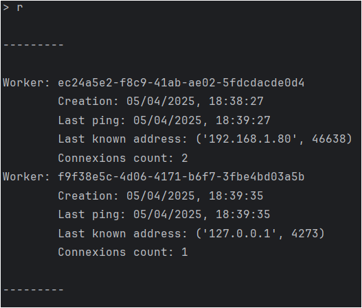
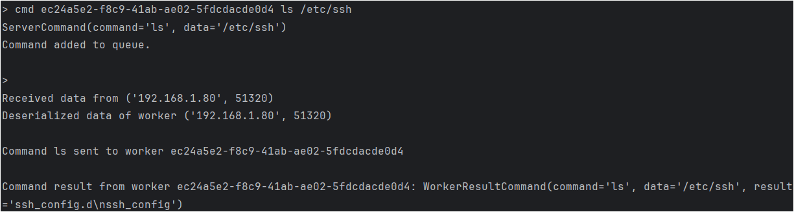
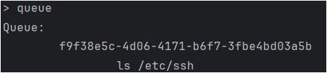
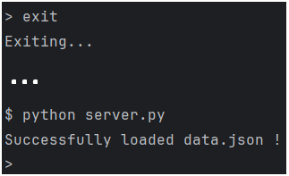
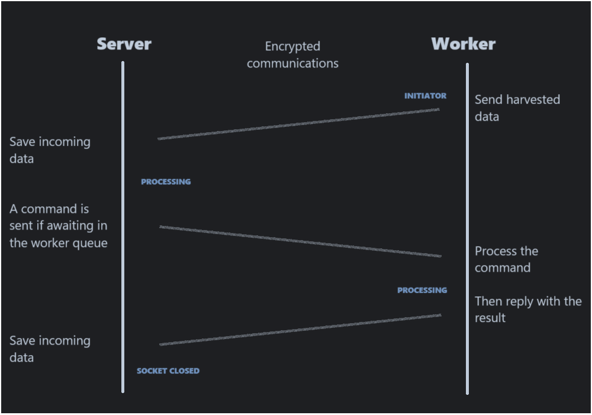

# Command & Control

> No dependencies required ! So no `VENV` nor `pip install` needed.

## OpenSSL

Run these commands to generate the 
[SSL certificate*](https://gist.github.com/marshalhayes/ca9508f97d673b6fb73ba64a67b76ce8).
From a GitBash terminal on Windows or any terminal on Linux.

```shell
cd .ssh

openssl genrsa -out rootCA.key 2048
openssl req -x509 -new -nodes -key rootCA.key -sha256 -days 365 -out rootCA.pem
```

> There already is a key for testing purposes in the `.ssh` folder

## Start server and workers

### Server

```shell
python3 server.py
```

> The server listen to the port `55612`.

**Server commands :**

`r`
: To print a "recap" of all registered workers

&nbsp;&nbsp;&nbsp;&nbsp;

`cmd <worker uuid> <command to run> <*additionnal args>`
: Add a command to the queue for a worker. Run `cmd` alone to get an additionnal help.
: Exemple: `cmd d973c272-97d5-48c3-b737-601b4b65bace ping google.com`

&nbsp;&nbsp;&nbsp;&nbsp;

`queue`
: To print a "recap" of all workers having queued commands.

&nbsp;&nbsp;&nbsp;&nbsp;

`exit`
: Smoothly stop the thread before closing the socket.
: Also persist the workers data into a JSON file that will be automatically reloaded at the next start.

&nbsp;&nbsp;&nbsp;&nbsp;

### Worker

```shell
python3 worker.py
  <server ip = "localhost">
  <server port = 55612> 
  <worker identifier = a random UUID V4>
# All arguments are optionnal with their default value
```

## Diagram representing communications Server <-> Worker

